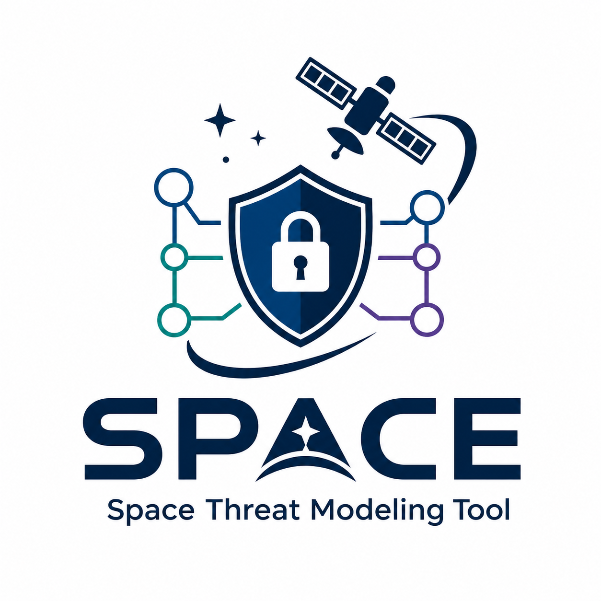
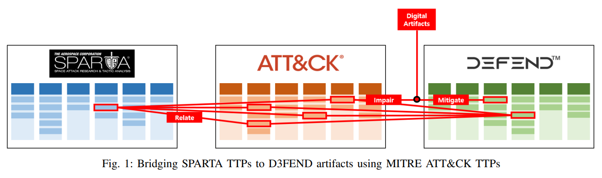
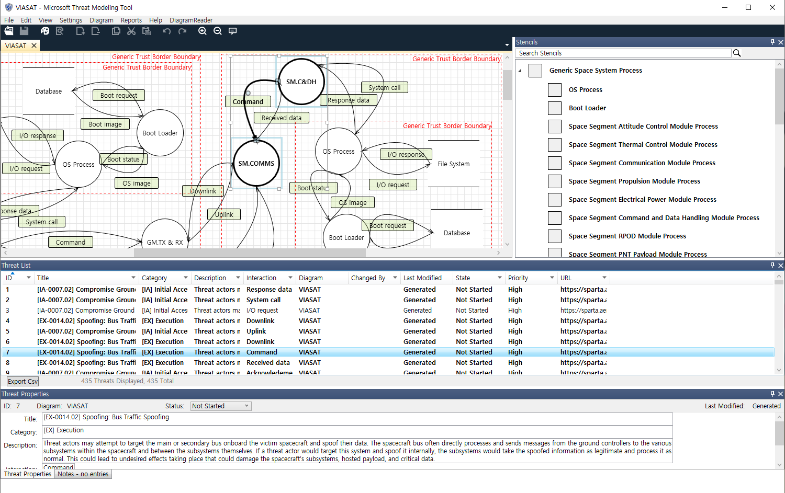

  

<h1 align="center">Space Systems Threat Modeling Template</h1>

  A domain-specific template (<code>.tb7</code>) for the <a href="https://learn.microsoft.com/en-us/azure/security/develop/threat-modeling-tool">Microsoft Threat Modeling Tool</a> that <b>automatically identifies space-domain cyber threats</b> when users build Data Flow Diagrams of satellite and ground system architectures.

---

## About

As space systems become increasingly interconnected and dependent on open platformsE, their cyber-attack surface continues to expand. Accordingly, major space cybersecurity policies and standards — including SPD-5, NIST, and ISO — emphasize the importance of threat modeling as a foundational security activity. However, existing threat modeling tools and templates do not address the unique threat landscape of the space domain.

This template enables **automated, space-specific threat identification** within the Microsoft Threat Modeling Tool by bridging three cybersecurity knowledge bases — [SPARTA](https://sparta.aerospace.org), [MITRE ATT&CK](https://attack.mitre.org), and [D3FEND](https://d3fend.mitre.org). The MITRE ATT&CK serves as the logical intermediary that maps space-specific threats (SPARTA) to defensive artifact properties (D3FEND DAO) embedded in each stencil.

When a user constructs a Data Flow Diagram of a space system architecture, the tool automatically generates relevant SPARTA-mapped threats based on the components and data flows in the diagram.

  

## Prerequisites

| Requirement | Note |
|---|---|
| **Microsoft Threat Modeling Tool** | Free download from [Microsoft](https://aka.ms/threatmodelingtool). Windows only. |

No other software or library is required.

## Quick Start

1. Download the `.tb7` template file from this repository.
2. Open Microsoft Threat Modeling Tool.
3. Go to **File → New Template** (or **Open Template**) and load the downloaded `.tb7` file.
4. Create a new model or load an existing one on the loaded template.
5. Build a Data Flow Diagram by dragging stencils onto the canvas, selecting the properties that match your system components, and connecting them with data flows.
6. Switch to the **Analysis View** — the tool automatically generates SPARTA-mapped threats based on the diagram.

  

## Publication and Presentation

This template implements the methodology proposed in the following paper, which was presented at [SpaceSec 2026 (4th Workshop on the Security of Space and Satellite Systems Co-located with the NDSS Symposium)](https://www.ndss-symposium.org/ndss2026/co-located-events/spacesec/) and [CYSAT Europe 2026](https://cysat.eu/cysat-europe/):

> **Towards Automated Threat Modeling for Space Systems via SPARTA Matrix**
>
> Joonhyuk Park, Jiwon Kwak, Geunwoo Baek, Dohee Kang and Seungjoo Kim*
>
> SpaceSec 2026, co-located with NDSS 2026, February 23, 2026, San Diego, CA, USA
>
> [[Paper]](https://www.ndss-symposium.org/wp-content/uploads/spacesec26-67.pdf)

## License

This project is licensed under the [MIT License](LICENSE).

## Contact
- **Seungjoo Kim (Corresponding Author)** — Professor, Korea University, School of Cybersecurity (skim71@korea.ac.kr)
- **Joonhyuk Park (First author)** — M.S. course, Korea University, School of Cybersecurity (peter990527@korea.ac.kr)
- **Our Lab** — [Security Automation aNd Engineering Lab (SANE Lab)](https://sites.google.com/view/seceng/home)
- **Link to short Survey** - https://docs.google.com/forms/d/e/1FAIpQLSd6thG28_vddNuhwQ77xjJSMZ-slffw31CyKSXNZqogMCmdSw/viewform?usp=header
